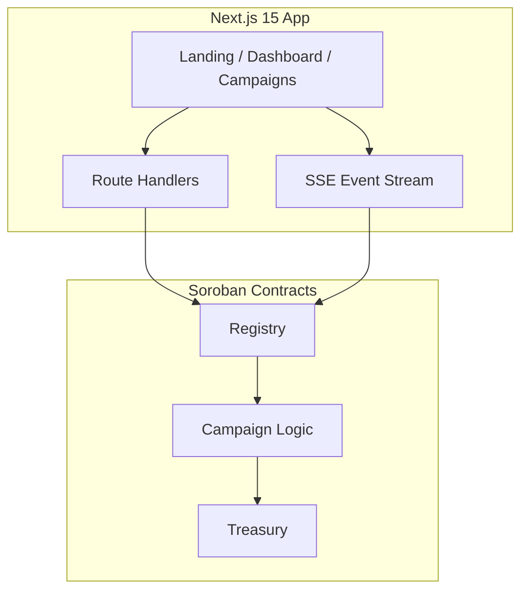

# StellarFund

**The decentralized crowdfunding platform powered by Stellar.**

StellarFund is a production-ready Soroban dApp where creators launch campaigns, contributors fund them with XLM, and smart contracts enforce success/refund rules automatically.

---

## Architecture



| Contract | Role |
|----------|------|
| **Registry** | Public entry point — create, list, contribute, withdraw, refund |
| **Campaign** | Business rules, deadlines, goal tracking, status transitions |
| **Treasury** | Fund accounting, contribution ledger, withdraw/refund authorization |

**Inter-contract flow:** `Registry → Campaign → Treasury`

---

## Folder Structure

```
stellarfund/
├── apps/web/              # Next.js 15 frontend + API routes
├── contracts/
│   ├── registry/
│   ├── campaign/
│   └── treasury/
├── packages/shared/       # Shared types (optional)
├── scripts/               # Deploy scripts
├── docs/                  # Documentation
└── .github/workflows/     # CI/CD
```

---

## Prerequisites

- Node.js 22+
- Rust + Stellar CLI
- Funded Stellar testnet wallet (Freighter recommended)

---

## Installation

```bash
# Contracts
cd contracts && cargo test

# Frontend
cd apps/web && npm install
cp .env.example .env.local
```

---

## Deploy Contracts (Testnet)

**Windows:**
```powershell
.\scripts\deploy.ps1 -Network testnet -Identity deployer
```

**macOS/Linux:**
```bash
chmod +x scripts/deploy.sh
./scripts/deploy.sh testnet deployer
```

Set output in `apps/web/.env.local`:
```env
NEXT_PUBLIC_REGISTRY_ID=<registry_contract_id>
NEXT_PUBLIC_SOROBAN_RPC=https://soroban-testnet.stellar.org
NEXT_PUBLIC_NETWORK=TESTNET
```

---

## Run Frontend

```bash
cd apps/web
npm run dev
```

Open **http://localhost:3000**

---

## Testing

```bash
# Contract tests (18 tests)
cd contracts && cargo test

# Frontend unit tests (23 tests)
cd apps/web && npm test

# E2E (Playwright)
cd apps/web && npm run test:e2e
```

---

## Environment Variables

| Variable | Description |
|----------|-------------|
| `NEXT_PUBLIC_REGISTRY_ID` | Deployed registry contract address |
| `NEXT_PUBLIC_SOROBAN_RPC` | Soroban RPC URL |
| `NEXT_PUBLIC_NETWORK` | `TESTNET` |

No secrets in frontend. Deploy identity stays in Stellar CLI only.

---

## Deployment (Vercel)

The Next.js app lives in **`apps/web`**. A platform `404: NOT_FOUND` (with `Code: NOT_FOUND` and an ID like `bom1::...`) is **Vercel’s error**, not your app — it means Vercel is not serving a Next.js build.

**Your code is fine:** GitHub Actions **Frontend** job passes (`npm ci`, lint, test, `next build` with routes `/`, `/campaigns`, etc.).

### Why this happens (checklist)

| Check | Wrong (causes 404) | Correct |
|-------|-------------------|---------|
| Root Directory | `.` or empty | **`apps/web`** |
| Framework Preset | **Other** | **Next.js** |
| Output Directory | `.next`, `out`, `dist`, or any custom path | **blank** (default) |
| Build logs | Failed or no `next build` | Shows `✓ Compiled successfully` |
| URL you open | Old preview / failed deploy | **Production** URL from green deploy card |

### Fix “Production Overrides differ from Project Settings”

If Production shows **`npm ci --prefix apps/web`** but Root Directory is **`apps/web`**, that override is **wrong** — it tries to install into `apps/web/apps/web` and breaks the deploy (404 NOT_FOUND).

1. **Settings → General → Root Directory** = **`apps/web`** → Save
2. **Settings → Build and Deployment → Framework Settings**
3. **Install Command** → toggle override **OFF** (leave empty; Vercel runs `npm ci` inside `apps/web`)
4. **Build Command** → override **OFF** (default `next build`)
5. **Output Directory** → override **OFF** (must stay empty for Next.js)
6. **Framework Preset** → **Next.js**
7. **Deployments** → ⋮ on latest → **Redeploy** → Production → uncheck **Use existing Build Cache**

After redeploy, Production Overrides should **match** Project Settings (no stale `npm ci --prefix apps/web`).

### Option A — Re-import (most reliable)

1. [vercel.com/new](https://vercel.com/new) → import **`abdulahaddayater/StellarFund`**
2. **Root Directory** → Edit → select **`apps/web`** (Next.js icon)
3. **Framework Preset** → **Next.js**
4. Leave **Build Command**, **Output Directory**, and **Install Command** **empty**
5. Add env vars (Production + Preview):

| Variable | Example |
|----------|---------|
| `NEXT_PUBLIC_REGISTRY_ID` | Deployed registry contract ID (required for real campaigns) |
| `NEXT_PUBLIC_SOROBAN_RPC` | `https://soroban-testnet.stellar.org` |
| `NEXT_PUBLIC_NETWORK` | `TESTNET` |

6. Deploy → open the **Production** URL from the successful deployment

### Option B — Fix existing Vercel project

1. **Settings → General → Root Directory** = `apps/web` → **Save**
2. **Settings → Build and Deployment → Framework Preset** = **Next.js**
3. Clear **Output Directory**, **Build Command**, and **Install Command** overrides
4. **Deployments** → **Redeploy** → uncheck **Use existing Build Cache**
5. In build logs, confirm you see:
   - `npm ci` (not `npm ci --prefix apps/web`)
   - `next build`
   - `Route (app)` table with `/`

Contract deploy uses `scripts/deploy.ps1` / `scripts/deploy.sh` (manual).

---

## Smart Contract API

| Function | Description |
|----------|-------------|
| `create_campaign` | Launch new campaign |
| `get_campaign` | Fetch campaign data |
| `list_campaigns` | All campaign IDs |
| `contribute` | Back a campaign |
| `withdraw` | Creator withdraws after success |
| `refund` | Contributor refund after failure |
| `cancel_campaign` | Creator cancels active campaign |

**Events:** CampaignCreated, ContributionReceived, GoalReached, CampaignSucceeded, CampaignFailed, FundsWithdrawn, RefundIssued, CampaignCancelled

---

## Future Roadmap

- Mainnet deployment
- Stellar asset support (USDC)
- Milestone-based funding
- On-chain comments
- Mobile app
- Governance / DAO treasury

---

## License

MIT

**Built on Stellar Soroban — Level 3 Production dApp**
