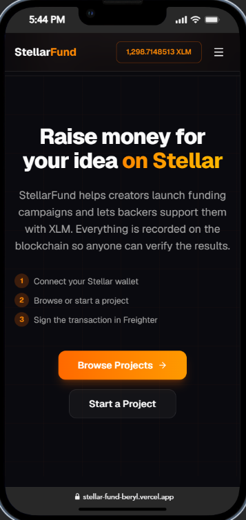
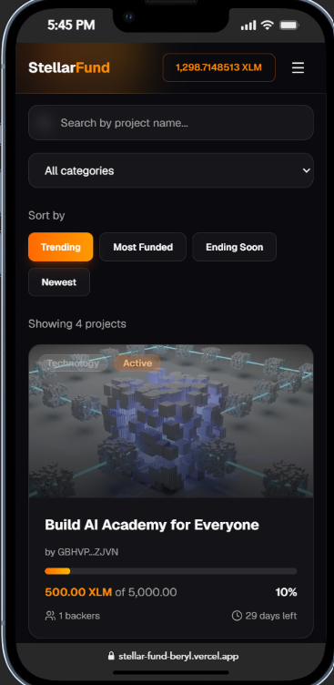
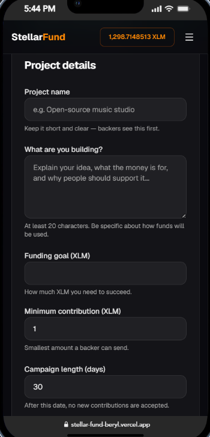
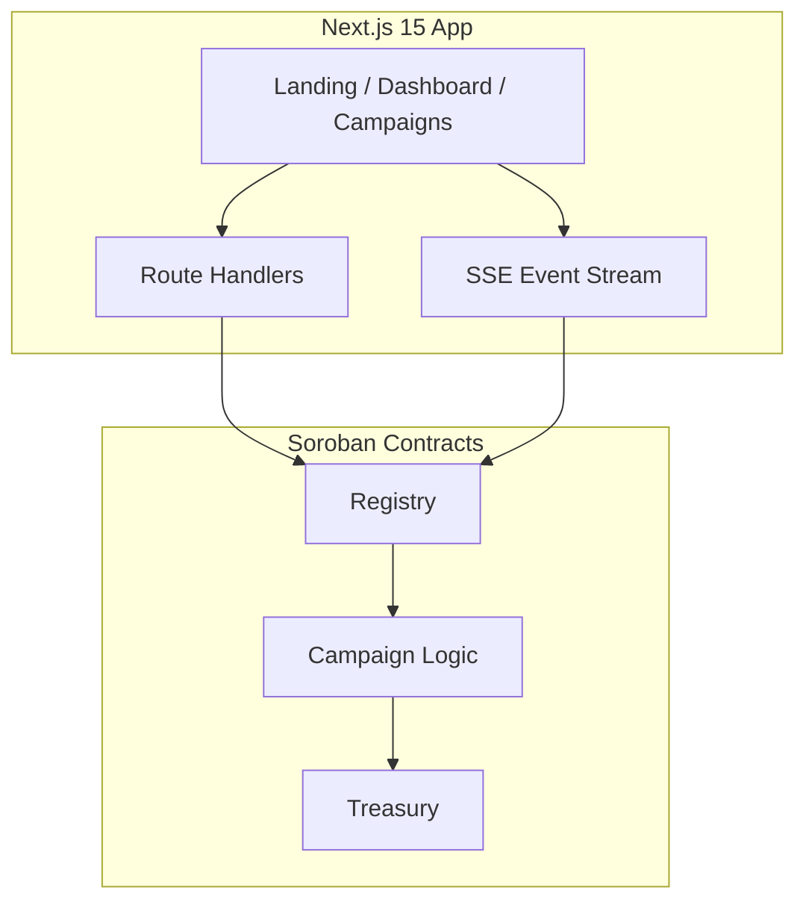

# StellarFund

[](https://github.com/abdulahaddayater/StellarFund/actions/workflows/ci.yml)

**Live app:** [https://stellar-fund-beryl.vercel.app](https://stellar-fund-beryl.vercel.app)

**Testnet registry:** `CA3BDZTCZUSZRXIDGCCPPQWFQXNGU63JAOBATMOZ75GIPDMFCTVX47YU` — see [`deployments.testnet.json`](deployments.testnet.json) (local, gitignored after deploy).

Decentralized crowdfunding on **Stellar Soroban**.

Creators launch funding campaigns with XLM goals and deadlines. Contributors back projects through a registry contract; smart contracts enforce success, withdrawal, and automatic refunds when goals are not met.

## Demo

| Resource | Link |
| --- | --- |
| **Live app** | [https://stellar-fund-beryl.vercel.app](https://stellar-fund-beryl.vercel.app) |
| **Browse projects** | [https://stellar-fund-beryl.vercel.app/campaigns](https://stellar-fund-beryl.vercel.app/campaigns) |
| **Registry contract** | [Stellar Expert](https://stellar.expert/explorer/testnet/contract/CA3BDZTCZUSZRXIDGCCPPQWFQXNGU63JAOBATMOZ75GIPDMFCTVX47YU) |
| **Campaign contract** | [Stellar Expert](https://stellar.expert/explorer/testnet/contract/CBM3TVCTAHO6H3LRURNODXG7XQIGIXB7DIUKTUW5YRKOM3TG63WUGPU3) |
| **Treasury contract** | [Stellar Expert](https://stellar.expert/explorer/testnet/contract/CB5BGRAE5WUKLV5N5L4LOI5NREJHVB27P3CECTE67PO325LNXTKAENNF) |
| **Create campaign tx** | _Add your transaction hash after first on-chain create_ |
| **Demo video** | [Google Drive](https://drive.google.com/file/d/1eHspV2lHaRTKzdqxa206hcrc4Wyeiqnx/view?usp=sharing) |

Every on-chain action can be verified on Stellar Expert using this URL pattern:

```
https://stellar.expert/explorer/testnet/tx/{transaction_hash}
```

## Screenshots

### Mobile responsive UI

Production app at [stellar-fund-beryl.vercel.app](https://stellar-fund-beryl.vercel.app) on mobile (~390px):

| Home | Browse projects | Create project |
| :---: | :---: | :---: |
|  |  |  |

### CI/CD pipeline

[GitHub Actions](https://github.com/abdulahaddayater/StellarFund/actions) on every push to `main` — contract tests, frontend lint/tests/build, and Playwright E2E:


### Test output

`npm test` in `apps/web` — **38 passing tests** across 10 files; `cargo test` in `contracts` — **18 passing tests**:


## Features

- Freighter / Stellar Wallets Kit connect and disconnect
- Create crowdfunding campaigns on Soroban testnet
- Contribute XLM with wallet-signed transactions
- Creator withdraw after goal reached; contributor refunds after failure
- Live dashboard with SSE activity feed infrastructure
- **Styled UI** — cards, status badges, responsive layout, loading and error states
- **Inter-contract architecture** — Registry → Campaign → Treasury

## Stack

| Layer | Technology |
| --- | --- |
| Frontend | Next.js 15, React 19, TypeScript, Tailwind v4 |
| Forms | React Hook Form, Zod |
| Wallet | Stellar Wallets Kit, Freighter |
| Chain | `@stellar/stellar-sdk`, Soroban RPC |
| Contracts | Rust, Soroban SDK (registry, campaign, treasury) |
| Tooling | npm, Vitest, Playwright, ESLint, GitHub Actions |

## Installation

### Prerequisites

- [Node.js](https://nodejs.org/) 22+
- [Freighter](https://www.freighter.app/) browser extension
- [Rust](https://rustup.rs/) + [Stellar CLI](https://developers.stellar.org/docs/tools/developer-tools/cli/stellar-cli) (for contracts)
- Funded Stellar testnet wallet

```bash
rustup target add wasm32v1-none
```

### Setup

```bash
git clone https://github.com/abdulahaddayater/StellarFund.git
cd StellarFund
cd apps/web && npm install
cp .env.example .env.local
```

Edit `apps/web/.env.local` and set `NEXT_PUBLIC_REGISTRY_ID` after deploying contracts (see [Deployment](#deployment)).

### Development

```bash
cd apps/web
npm run dev
```

Open [http://localhost:3000](http://localhost:3000).

### Production build

```bash
cd apps/web
npm run build
npm start
```

## Environment variables

Copy [`apps/web/.env.example`](apps/web/.env.example) to `apps/web/.env.local`:

| Variable | Required | Description | Default |
| --- | --- | --- | --- |
| `NEXT_PUBLIC_REGISTRY_ID` | Yes\* | Deployed registry contract ID (`C…`) | — |
| `NEXT_PUBLIC_SOROBAN_RPC` | No | Soroban RPC URL | `https://soroban-testnet.stellar.org` |
| `NEXT_PUBLIC_NETWORK` | No | `TESTNET` or `PUBLIC` | `TESTNET` |

\*Required for on-chain flows. **Deployed testnet registry ID:** `CA3BDZTCZUSZRXIDGCCPPQWFQXNGU63JAOBATMOZ75GIPDMFCTVX47YU`

No secrets in the frontend. Deploy identity stays in Stellar CLI only.

## Architecture



**Design principles**

1. **Funds on-chain** — contributions and escrow rules live in Soroban contracts.
2. **Registry facade** — the frontend talks to one registry address; it delegates to campaign logic.
3. **Inter-contract calls** — Campaign invokes Treasury for deposits, withdrawals, and refunds.
4. **Thin client** — API routes prepare XDR; the wallet signs and submits via Soroban RPC.
5. **Event-driven UI** — on-chain events plus SSE infrastructure for live dashboard updates.

### Campaign lifecycle

```
Active → Succeeded (creator withdraws)
      ↘ Failed (contributors refund)
      ↘ Cancelled (creator cancelled)
```

| Contract | Role |
| --- | --- |
| **Registry** | Public entry point — create, list, contribute, withdraw, refund |
| **Campaign** | Business rules, deadlines, goal tracking, status transitions |
| **Treasury** | Fund accounting, contribution ledger, withdraw/refund authorization |

**Inter-contract flow:** `Registry → Campaign → Treasury`

## Folder structure

```
stellarfund/
├── .github/workflows/     # CI (contracts, frontend, E2E)
├── apps/web/              # Next.js 15 frontend + API routes
│   ├── src/
│   │   ├── app/           # App Router pages and API handlers
│   │   ├── components/    # UI, layout, campaign cards
│   │   ├── hooks/         # Campaigns, event stream
│   │   ├── lib/           # Soroban client, API helpers, utils
│   │   └── providers/     # Wallet provider
│   ├── e2e/               # Playwright smoke tests
│   └── package.json
├── contracts/
│   ├── registry/          # Public registry facade
│   ├── campaign/          # Campaign logic + rules
│   └── treasury/          # Escrow accounting
├── docs/
│   ├── architecture.md
│   └── screenshots/       # README screenshot assets
├── packages/shared/       # Shared types (optional)
├── scripts/               # deploy.ps1, deploy.sh, verify-deploy.ps1
└── README.md
```

Contract details: [`docs/architecture.md`](docs/architecture.md)

## Soroban contracts

Three contracts work together on testnet.

| Function | Description |
| --- | --- |
| `create_campaign` | Launch new campaign |
| `get_campaign` | Fetch campaign data |
| `list_campaigns` | All campaign IDs |
| `contribute` | Back a campaign |
| `withdraw` | Creator withdraws after success |
| `refund` | Contributor refund after failure |
| `cancel_campaign` | Creator cancels active campaign |

**Events:** `CampaignCreated`, `ContributionReceived`, `GoalReached`, `CampaignSucceeded`, `CampaignFailed`, `FundsWithdrawn`, `RefundIssued`, `CampaignCancelled`

Build and test:

```bash
cd contracts && cargo test
stellar contract build --package registry
stellar contract build --package campaign
stellar contract build --package treasury
```

Redeploy contracts after pulling contract changes before testing on testnet.

## Demo instructions

End-to-end walkthrough on **Stellar testnet**:

### 1. Prepare wallet

- Install [Freighter](https://www.freighter.app/)
- Switch Freighter to **Testnet**
- Fund your account from the [Stellar Laboratory faucet](https://laboratory.stellar.org/#account-creator?network=testnet)

### 2. Deploy contracts

**Windows:**

```powershell
.\scripts\deploy.ps1 -Network testnet -Identity deployer
```

**macOS/Linux:**

```bash
chmod +x scripts/deploy.sh
./scripts/deploy.sh testnet deployer
```

Copy the registry ID into `apps/web/.env.local`:

```env
NEXT_PUBLIC_REGISTRY_ID=CA3BDZTCZUSZRXIDGCCPPQWFQXNGU63JAOBATMOZ75GIPDMFCTVX47YU
NEXT_PUBLIC_SOROBAN_RPC=https://soroban-testnet.stellar.org
NEXT_PUBLIC_NETWORK=TESTNET
```

Restart `npm run dev`.

### 3. Create a project (creator wallet)

1. Open `/campaigns/create` and connect Freighter
2. Fill title, description, goal, deadline, and category
3. Submit and approve the transaction in Freighter
4. Confirm the project appears on `/campaigns` and `/dashboard`

### 4. Contribute (backer wallet)

1. Open a project from **Browse Projects** (`/campaigns/[id]`)
2. Connect Freighter as a **backer**
3. Enter an amount (above the minimum) and contribute
4. Approve the transaction in Freighter

### 5. Withdraw or refund

- **Creator:** after the goal is reached, withdraw from the project page
- **Backer:** if the campaign fails, request a refund from the project page

## Deployment

### Frontend (Vercel)

Production URL: **https://stellar-fund-beryl.vercel.app**

The Next.js app lives in **`apps/web`**.

1. Import the repo in [Vercel](https://vercel.com/new)
2. **Root Directory:** `apps/web`
3. **Framework preset:** Next.js
4. Leave **Build Command**, **Output Directory**, and **Install Command** empty (defaults)
5. Add these **Environment Variables** (Production + Preview):

```env
NEXT_PUBLIC_REGISTRY_ID=CA3BDZTCZUSZRXIDGCCPPQWFQXNGU63JAOBATMOZ75GIPDMFCTVX47YU
NEXT_PUBLIC_SOROBAN_RPC=https://soroban-testnet.stellar.org
NEXT_PUBLIC_NETWORK=TESTNET
```

6. Deploy — then **Redeploy** without build cache after changing env vars

All `NEXT_PUBLIC_*` vars must be set at **build time**.

**Vercel troubleshooting:** If you see `404: NOT_FOUND`, confirm Root Directory is `apps/web` (not `./`), Framework is **Next.js**, and Install Command override is **off** (not `npm ci --prefix apps/web`).

### Contracts (testnet)

Deployed contract addresses are written to `deployments.testnet.json` after running the deploy script.

```bash
cd contracts && cargo test
./scripts/deploy.sh testnet deployer   # or .\scripts\deploy.ps1 on Windows
```

After deployment:

1. Copy the **registry** ID from `deployments.testnet.json`
2. Set `NEXT_PUBLIC_REGISTRY_ID` in Vercel / `.env.local`
3. Redeploy the frontend

## How to test

### Quick local test

```bash
cd apps/web
npm install
cp .env.example .env.local
# Add your registry contract ID to .env.local
npm run dev
```

Open [http://localhost:3000](http://localhost:3000), connect Freighter on **Testnet**, and walk through create → contribute → dashboard.

### Test against production

1. Open [https://stellar-fund-beryl.vercel.app](https://stellar-fund-beryl.vercel.app)
2. Install Freighter and switch to **Testnet**
3. Fund your account via [Stellar Laboratory friendbot](https://laboratory.stellar.org/#account-creator?network=testnet)
4. **Creator:** `/campaigns/create` → launch a project → approve tx in Freighter
5. **Backer:** open the project → contribute XLM → approve tx in Freighter
6. **Creator / backer:** withdraw or refund when campaign rules apply

### Automated tests

```bash
# Contract tests (18 tests)
cd contracts && cargo test

# Frontend unit tests (38 tests)
cd apps/web && npm test

# E2E (Playwright)
cd apps/web && npm run test:e2e
```

## Testing (CI)

| Suite | Command | Count |
| --- | --- | --- |
| Frontend | `cd apps/web && npm test` | 38 tests |
| Contracts | `cd contracts && cargo test` | 18 tests |
| E2E | `cd apps/web && npm run test:e2e` | 4 tests |

GitHub Actions runs on every push/PR to `main` (contracts, frontend lint/test/build, Playwright): [`.github/workflows/ci.yml`](.github/workflows/ci.yml)

## Developer notes

### Scripts

| Command | Description |
| --- | --- |
| `npm run dev` | Development server (`apps/web`) |
| `npm run build` | Production build |
| `npm run lint` | ESLint |
| `npm test` | Vitest unit tests |
| `npm run test:e2e` | Playwright E2E |
| `.\scripts\verify-deploy.ps1` | Local pre-deploy check |

### Conventions

- **Dark theme** — consistent UI across landing, campaigns, and dashboard
- **On-chain only** — no placeholder campaigns in production API routes
- **API routes** — prepare Soroban XDR in `apps/web/src/app/api/`
- **Wallet flow** — connect → prepare tx → sign in Freighter → submit via RPC

## Future improvements

- [ ] Wire SSE to live Soroban contract events
- [ ] Mainnet deployment
- [ ] Stellar asset support (USDC)
- [ ] Milestone-based funding
- [ ] On-chain comments
- [ ] Mobile app
- [ ] Governance / DAO treasury

## Contributing

1. Fork the repository
2. Create a feature branch
3. Run `npm test` and `cargo test` before opening a PR
4. Open a pull request with a clear description

## Submission

| Item | Status |
| --- | --- |
| Public GitHub repo | [abdulahaddayater/StellarFund](https://github.com/abdulahaddayater/StellarFund) |
| Live demo | [stellar-fund-beryl.vercel.app](https://stellar-fund-beryl.vercel.app) |
| Registry contract | `CA3BDZTCZUSZRXIDGCCPPQWFQXNGU63JAOBATMOZ75GIPDMFCTVX47YU` |
| Campaign contract | `CBM3TVCTAHO6H3LRURNODXG7XQIGIXB7DIUKTUW5YRKOM3TG63WUGPU3` |
| Treasury contract | `CB5BGRAE5WUKLV5N5L4LOI5NREJHVB27P3CECTE67PO325LNXTKAENNF` |
| Transaction hash | _Add after first on-chain interaction_ |
| Demo video | [Google Drive](https://drive.google.com/file/d/1eHspV2lHaRTKzdqxa206hcrc4Wyeiqnx/view?usp=sharing) |
| Screenshots | Mobile UI added under `docs/screenshots/` (see [Screenshots](#screenshots)); add CI and test output images when ready |

## License

MIT

**Built on Stellar Soroban — Level 3 Production dApp**
