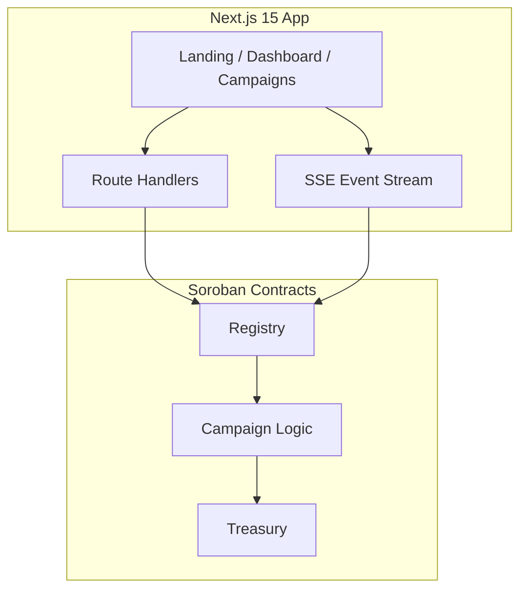

# StellarFund

**The decentralized crowdfunding platform powered by Stellar.**

StellarFund is a production-ready Soroban dApp where creators launch campaigns, contributors fund them with XLM, and smart contracts enforce success/refund rules automatically.

---

## Architecture



| Contract | Role |
|----------|------|
| **Registry** | Public entry point — create, list, contribute, withdraw, refund |
| **Campaign** | Business rules, deadlines, goal tracking, status transitions |
| **Treasury** | Fund accounting, contribution ledger, withdraw/refund authorization |

**Inter-contract flow:** `Registry → Campaign → Treasury`

---

## Folder Structure

```
stellarfund/
├── apps/web/              # Next.js 15 frontend + API routes
├── contracts/
│   ├── registry/
│   ├── campaign/
│   └── treasury/
├── packages/shared/       # Shared types (optional)
├── scripts/               # Deploy scripts
├── docs/                  # Documentation
└── .github/workflows/     # CI/CD
```

---

## Prerequisites

- Node.js 22+
- Rust + Stellar CLI
- Funded Stellar testnet wallet (Freighter recommended)

---

## Installation

```bash
# Contracts
cd contracts && cargo test

# Frontend
cd apps/web && npm install
cp .env.example .env.local
```

---

## Deploy Contracts (Testnet)

**Windows:**
```powershell
.\scripts\deploy.ps1 -Network testnet -Identity deployer
```

**macOS/Linux:**
```bash
chmod +x scripts/deploy.sh
./scripts/deploy.sh testnet deployer
```

Set output in `apps/web/.env.local`:
```env
NEXT_PUBLIC_REGISTRY_ID=<registry_contract_id>
NEXT_PUBLIC_SOROBAN_RPC=https://soroban-testnet.stellar.org
NEXT_PUBLIC_NETWORK=TESTNET
```

---

## Run Frontend

```bash
cd apps/web
npm run dev
```

Open **http://localhost:3000**

---

## Testing

```bash
# Contract tests (18 tests)
cd contracts && cargo test

# Frontend unit tests (23 tests)
cd apps/web && npm test

# E2E (Playwright)
cd apps/web && npm run test:e2e
```

---

## Environment Variables

| Variable | Description |
|----------|-------------|
| `NEXT_PUBLIC_REGISTRY_ID` | Deployed registry contract address |
| `NEXT_PUBLIC_SOROBAN_RPC` | Soroban RPC URL |
| `NEXT_PUBLIC_NETWORK` | `TESTNET` |

No secrets in frontend. Deploy identity stays in Stellar CLI only.

---

## Deployment (Vercel)

1. Import repo, set **Root Directory** to `apps/web`
2. Add environment variables above
3. Deploy

Contract deploy uses GitHub Actions manual workflow or `scripts/deploy.ps1`.

---

## Smart Contract API

| Function | Description |
|----------|-------------|
| `create_campaign` | Launch new campaign |
| `get_campaign` | Fetch campaign data |
| `list_campaigns` | All campaign IDs |
| `contribute` | Back a campaign |
| `withdraw` | Creator withdraws after success |
| `refund` | Contributor refund after failure |
| `cancel_campaign` | Creator cancels active campaign |

**Events:** CampaignCreated, ContributionReceived, GoalReached, CampaignSucceeded, CampaignFailed, FundsWithdrawn, RefundIssued, CampaignCancelled

---

## Future Roadmap

- Mainnet deployment
- Stellar asset support (USDC)
- Milestone-based funding
- On-chain comments
- Mobile app
- Governance / DAO treasury

---

## License

MIT

**Built on Stellar Soroban — Level 3 Production dApp**
